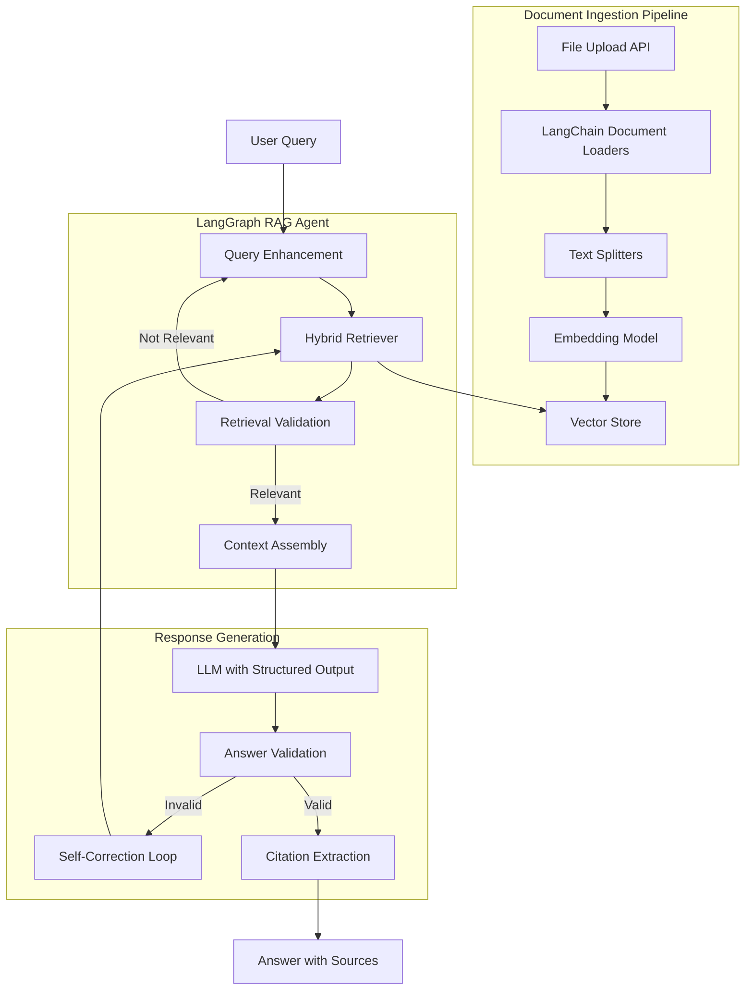
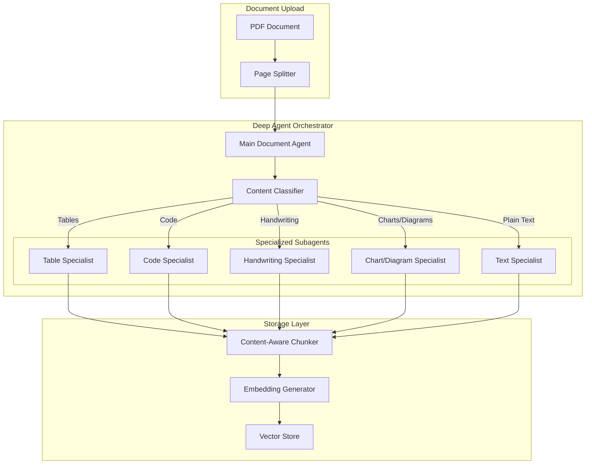
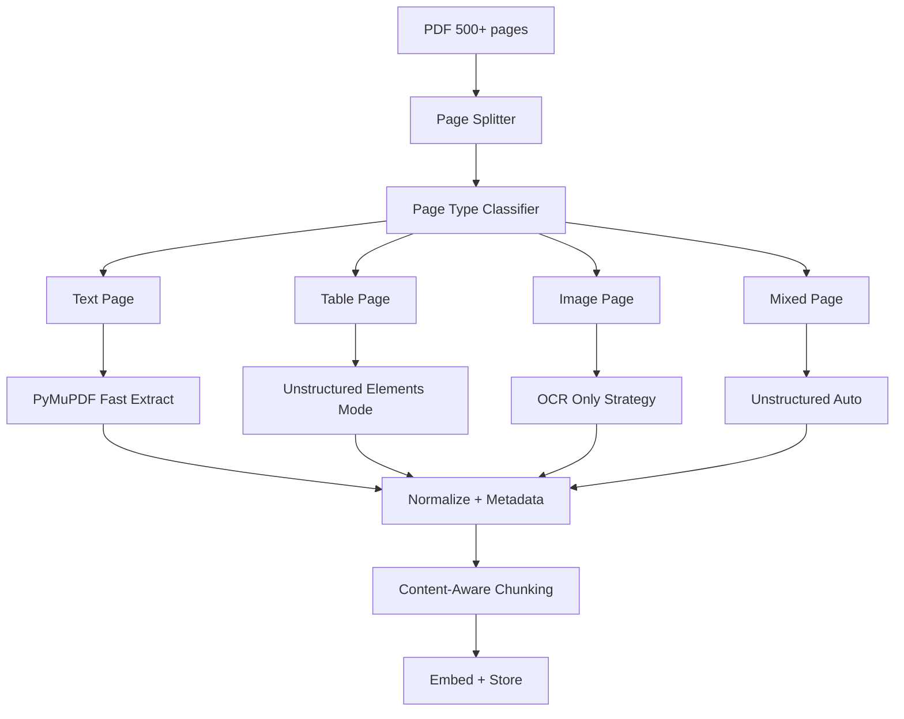

# DocMind RAG - Enterprise Document Intelligence Platform

## Overview

**DocMind RAG** is a production-ready RAG application built with LangChain, LangGraph, and Deep Agents

## Architecture Overview (Full LangChain Ecosystem)

After reviewing the latest LangChain documentation, we leverage their complete ecosystem:

- **LangChain** for document loaders, text splitters, embeddings, and vector stores
- **LangGraph** for durable execution, state management, and complex RAG workflows
- **Deep Agents** for intelligent document processing orchestration with specialized subagents
- **Agentic RAG with Self-Correction** pattern for handling complex queries



## Deep Agents Architecture (Document Processing Orchestration)

Deep Agents provide intelligent orchestration for complex, multi-step document processing tasks. Instead of processing pages linearly, a main orchestrator agent delegates to specialized subagents based on content type.



### Why Deep Agents for Document Processing?

| Benefit | Description ||---------|-------------|| **Task Decomposition** | Complex 500+ page PDFs are broken into manageable subtasks || **Specialized Expertise** | Each subagent is optimized for its content type || **Context Isolation** | Subagents maintain focused context, avoiding confusion || **Parallel Processing** | Multiple subagents can work simultaneously || **Long-term Memory** | Processing state persists across sessions || **Adaptive Routing** | Main agent learns which subagent handles what best |

### Subagent Responsibilities

```python
from langchain.agents import create_agent
from langchain_openai import ChatOpenAI

# Table Specialist Subagent
table_specialist = create_agent(
    model="gpt-4o",
    tools=[
        extract_table_structure,
        detect_table_continuation,
        merge_multipage_tables,
        format_table_to_markdown,
    ],
    system_prompt="""You are a Table Extraction Specialist.
    Your job is to:
    1. Identify table boundaries on the page
    2. Detect if tables continue from previous pages
    3. Merge multi-page tables into complete units
    4. Convert tables to clean markdown format
    5. Preserve column headers and row relationships"""
)

# Code Specialist Subagent
code_specialist = create_agent(
    model="gpt-4o",
    tools=[
        detect_programming_language,
        extract_code_blocks,
        parse_with_ast,
        chunk_by_functions,
    ],
    system_prompt="""You are a Code Extraction Specialist.
    Your job is to:
    1. Identify code blocks in the document
    2. Detect the programming language
    3. Extract code while preserving formatting
    4. Split code by logical units (functions, classes)
    5. Add language metadata for syntax highlighting"""
)

# Handwriting Specialist Subagent
handwriting_specialist = create_agent(
    model="gpt-4o",  # Vision-capable
    tools=[
        detect_handwritten_regions,
        transcribe_handwriting,
        validate_transcription,
        handle_unclear_text,
    ],
    system_prompt="""You are a Handwriting Transcription Specialist.
    Your job is to:
    1. Identify handwritten regions on pages
    2. Accurately transcribe handwritten text
    3. Mark unclear portions with [unclear: ...]
    4. Preserve structure like lists and diagrams
    5. Note any annotations or margin notes"""
)

# Chart/Diagram Specialist Subagent
chart_specialist = create_agent(
    model="gpt-4o",  # Vision-capable
    tools=[
        classify_visual_type,
        describe_chart,
        extract_data_points,
        describe_diagram_flow,
    ],
    system_prompt="""You are a Visual Content Specialist.
    Your job is to:
    1. Classify visual content (chart, graph, diagram, flowchart)
    2. Generate detailed text descriptions
    3. Extract key data points and trends from charts
    4. Describe relationships and flows in diagrams
    5. Make visual content searchable via text"""
)

# Text Specialist Subagent (default)
text_specialist = create_agent(
    model="gpt-4o-mini",  # Faster for simple text
    tools=[
        extract_clean_text,
        remove_headers_footers,
        detect_section_headers,
        handle_cross_page_text,
    ],
    system_prompt="""You are a Text Extraction Specialist.
    Your job is to:
    1. Extract clean text from pages
    2. Remove repetitive headers and footers
    3. Identify section and chapter headers
    4. Handle text that continues across pages
    5. Preserve paragraph structure"""
)
```

### Main Orchestrator Agent

```python
from deepagents import DeepAgent, AgentHarness

class DocumentProcessingOrchestrator:
    def __init__(self):
        self.harness = AgentHarness(
            model="gpt-4o",
            subagents={
                "table": table_specialist,
                "code": code_specialist,
                "handwriting": handwriting_specialist,
                "chart": chart_specialist,
                "text": text_specialist,
            },
            memory_type="long_term",  # Persist across sessions
        )
        
        self.main_agent = DeepAgent(
            harness=self.harness,
            system_prompt="""You are the Document Processing Orchestrator.
            
            For each page in a document:
            1. Analyze the content type (text, table, code, handwriting, chart, mixed)
            2. Delegate to the appropriate specialist subagent
            3. For mixed pages, coordinate multiple subagents
            4. Aggregate results and ensure consistency
            5. Track processing state for resume capability
            
            Your goal is efficient, accurate document processing that preserves
            all content types while making them searchable."""
        )
    
    async def process_document(self, pdf_path: str, on_progress=None):
        """Process a document with intelligent orchestration"""
        pages = load_pdf_pages(pdf_path)
        results = []
        
        for i, page in enumerate(pages):
            # Main agent decides routing
            routing_decision = await self.main_agent.invoke({
                "task": "classify_and_route",
                "page_content": page.page_content,
                "page_number": i,
                "context": self._get_processing_context()
            })
            
            # Delegate to appropriate subagent(s)
            if routing_decision["content_types"]:
                for content_type in routing_decision["content_types"]:
                    subagent_result = await self.harness.delegate(
                        agent_name=content_type,
                        task=routing_decision["tasks"][content_type],
                        page=page
                    )
                    results.append(subagent_result)
            
            # Progress callback
            if on_progress:
                on_progress(current=i+1, total=len(pages))
        
        return self._aggregate_results(results)
    
    def _get_processing_context(self):
        """Get context from long-term memory"""
        return self.harness.memory.get_recent_context(limit=5)
    
    def _aggregate_results(self, results):
        """Combine results from all subagents"""
        documents = []
        for result in results:
            if isinstance(result, list):
                documents.extend(result)
            else:
                documents.append(result)
        return documents
```

### Integration with LangGraph RAG

```python
from langgraph.graph import StateGraph

# The Deep Agent orchestrator feeds into the LangGraph RAG pipeline
def create_full_pipeline():
    # Document processing with Deep Agents
    doc_orchestrator = DocumentProcessingOrchestrator()
    
    # RAG with LangGraph
    rag_agent = create_langgraph_rag_agent()
    
    # Full pipeline
    async def process_and_index(pdf_path: str):
        # Step 1: Deep Agent processes document
        documents = await doc_orchestrator.process_document(pdf_path)
        
        # Step 2: Store in vector database
        await vector_store.add_documents(documents)
        
        return {"status": "indexed", "chunks": len(documents)}
    
    async def query(question: str):
        # LangGraph RAG handles queries
        return await rag_agent.invoke({"query": question})
    
    return process_and_index, query
```

## Technology Stack (LangChain Ecosystem)

| Component | Technology | Rationale ||-----------|------------|-----------|| Framework | LangChain (Python) | Official RAG building blocks || Orchestration | LangGraph | Stateful workflows, durable execution || Agent Architecture | Deep Agents | Multi-step tasks, subagent delegation || Backend | FastAPI | Async support, LangServe integration || Document Parsing | LangChain Document Loaders + Unstructured | PDF, DOCX, HTML, images || Chunking | LangChain Text Splitters | Semantic, recursive, markdown-aware || Embeddings | OpenAI text-embedding-3-large | Via LangChain embeddings interface || Vector DB | Qdrant / Chroma | LangChain VectorStore integration || LLM | OpenAI GPT-4o / Claude 3.5 | Via LangChain ChatModel interface || Observability | LangSmith | Tracing, debugging, evaluation || Frontend | React + TypeScript | Modern chat interface |

## Page-Level Adaptive PDF Ingestion (Critical for Large Documents)

This is the core innovation for handling large PDFs efficiently. Never process 500 pages at once!



### Step 1: Split PDF into Pages (Mandatory)

```python
from langchain.document_loaders import PyMuPDFLoader

pages = PyMuPDFLoader("large.pdf").load()
# Each page becomes Document with metadata: {"page": 42}
```

### Step 2: Page Type Classification (Critical)

Classify before extraction to prevent unnecessary OCR, table corruption, and latency.

```python
def classify_page(page):
    text = page.page_content.strip()
    
    if len(text) < 30:
        return "image"        # Needs OCR
    
    if "|" in text or "Table" in text:
        return "table"        # Needs structure preservation
    
    if has_mixed_layout(text):
        return "mixed"        # Needs auto detection
    
    return "text"             # Fast extraction OK
```

### Step 3: Dynamic Extraction Strategy

| Page Type | Extractor | Rationale ||-----------|-----------|-----------|| Text only | PyMuPDF | Fast, accurate for pure text || Tables | Unstructured (elements) | Preserves table structure || Image-only | OCR (Unstructured/Cloud) | Only option for scanned pages || Mixed | Unstructured (auto) | Handles complex layouts |

```python
def extract_page(page, pdf_path):
    page_no = page.metadata["page"]
    page_type = page.metadata["type"]

    if page_type == "text":
        return page  # Already extracted

    if page_type == "table":
        return UnstructuredPDFLoader(
            pdf_path, mode="elements", pages=[page_no]
        ).load()

    if page_type == "image":
        return UnstructuredPDFLoader(
            pdf_path, strategy="ocr_only", pages=[page_no]
        ).load()

    # Mixed pages
    return UnstructuredPDFLoader(
        pdf_path, strategy="auto", mode="elements", pages=[page_no]
    ).load()
```

### Step 4: Content-Aware Chunking (Very Important)

Never use uniform chunk sizes! Tables should never be split.| Content Type | Chunk Strategy ||--------------|----------------|| Text | 600-800 tokens with overlap || Tables | Whole table (no splitting) || OCR text | 300-500 tokens (noisier) |

```python
def chunk_document(doc):
    if doc.metadata.get("type") == "table":
        return [doc]  # Keep table intact
    
    if doc.metadata.get("type") == "image":
        return text_splitter_small.split_documents([doc])
    
    return text_splitter_normal.split_documents([doc])
```

### Step 5: Rich Metadata (Your Superpower)

```python
doc.metadata.update({
    "page": 42,
    "content_type": "table",
    "source": "large.pdf",
    "extraction_method": "unstructured_elements"
})
```

This enables: precise citations, page-level answers, content-type filtering, reranking.

### Step 6: Parallel Processing (Critical for Scale)

```python
from concurrent.futures import ThreadPoolExecutor

def process_page(page):
    page.metadata["type"] = classify_page(page)
    extracted = extract_page(page, pdf_path)
    chunks = chunk_document(extracted)
    return chunks

with ThreadPoolExecutor(max_workers=8) as pool:
    all_chunks = list(pool.map(process_page, pages))
```

---

## Critical Edge Case Handlers

### 1. Multi-Page Table Merging (Critical for Financial/Legal Docs)

Tables spanning multiple pages are common in reports. They get split and lose context if not handled.

```python
def detect_table_continuation(pages):
    """Detect and merge tables that span multiple pages"""
    merged_tables = []
    current_table = None
    
    for i, page in enumerate(pages):
        elements = extract_elements(page)
        
        for elem in elements:
            if elem.metadata.get("type") == "Table":
                # Check if this is a continuation
                if is_table_continuation(current_table, elem):
                    current_table = merge_tables(current_table, elem)
                else:
                    if current_table:
                        merged_tables.append(current_table)
                    current_table = elem
    
    return merged_tables

def is_table_continuation(prev_table, curr_table):
    """Heuristics for detecting continued tables"""
    if prev_table is None:
        return False
    
    # Check if column headers match
    prev_headers = extract_headers(prev_table)
    curr_headers = extract_headers(curr_table)
    
    # Check if table starts at top of page (likely continuation)
    starts_at_top = curr_table.metadata.get("y_position", 0) < 100
    
    # Check for "(continued)" or similar markers
    has_continuation_marker = "continued" in curr_table.page_content.lower()
    
    return (prev_headers == curr_headers and starts_at_top) or has_continuation_marker

def merge_tables(table1, table2):
    """Merge two table fragments into one"""
    merged_content = table1.page_content + "\n" + remove_headers(table2.page_content)
    return Document(
        page_content=merged_content,
        metadata={
            **table1.metadata,
            "spans_pages": [table1.metadata["page"], table2.metadata["page"]],
            "type": "table"
        }
    )
```

### 2. Vision Model Integration (Charts, Graphs, Diagrams)

For visual content that cannot be OCR'd meaningfully, use a vision model to generate descriptions.

```python
from langchain_openai import ChatOpenAI
from langchain_core.messages import HumanMessage
import base64

vision_model = ChatOpenAI(model="gpt-4o", max_tokens=1024)

def describe_visual_element(image_bytes, element_type="chart"):
    """Use vision model to describe charts, graphs, diagrams"""
    base64_image = base64.b64encode(image_bytes).decode("utf-8")
    
    prompts = {
        "chart": "Describe this chart in detail. Include: chart type, axes labels, data trends, key values, and any conclusions that can be drawn.",
        "graph": "Describe this graph in detail. Include: what is being measured, relationships shown, scale, and key data points.",
        "diagram": "Describe this diagram in detail. Include: what it represents, components, relationships, and flow if applicable.",
        "flowchart": "Describe this flowchart step by step. Include: start/end points, decision points, and the overall process flow."
    }
    
    message = HumanMessage(
        content=[
            {"type": "text", "text": prompts.get(element_type, prompts["chart"])},
            {"type": "image_url", "image_url": {"url": f"data:image/png;base64,{base64_image}"}}
        ]
    )
    
    response = vision_model.invoke([message])
    return response.content

def classify_visual_element(image_bytes):
    """Classify type of visual element"""
    # Use vision model or heuristics
    base64_image = base64.b64encode(image_bytes).decode("utf-8")
    
    message = HumanMessage(
        content=[
            {"type": "text", "text": "Classify this image as one of: chart, graph, diagram, flowchart, photo, or other. Reply with just the classification."},
            {"type": "image_url", "image_url": {"url": f"data:image/png;base64,{base64_image}"}}
        ]
    )
    
    response = vision_model.invoke([message])
    return response.content.strip().lower()
```

### 3. Header/Footer Removal

Repetitive headers and footers pollute the content and waste tokens.

```python
from collections import Counter

def detect_headers_footers(pages, threshold=0.7):
    """Detect repetitive headers/footers across pages"""
    first_lines = []
    last_lines = []
    
    for page in pages:
        lines = page.page_content.strip().split('\n')
        if lines:
            first_lines.append(lines[0].strip())
            last_lines.append(lines[-1].strip())
    
    # Find patterns that appear in >70% of pages
    header_pattern = find_common_pattern(first_lines, threshold)
    footer_pattern = find_common_pattern(last_lines, threshold)
    
    return header_pattern, footer_pattern

def find_common_pattern(lines, threshold):
    """Find patterns appearing above threshold frequency"""
    # Normalize lines (remove page numbers, dates)
    normalized = [normalize_line(line) for line in lines]
    counter = Counter(normalized)
    
    total = len(lines)
    for pattern, count in counter.most_common():
        if count / total >= threshold:
            return pattern
    return None

def normalize_line(line):
    """Normalize line by removing variable parts"""
    import re
    # Remove page numbers
    line = re.sub(r'\b(page\s*)?\d+\s*(of\s*\d+)?\b', '', line, flags=re.IGNORECASE)
    # Remove dates
    line = re.sub(r'\d{1,2}[/-]\d{1,2}[/-]\d{2,4}', '', line)
    return line.strip()

def remove_headers_footers(page_content, header_pattern, footer_pattern):
    """Remove detected headers and footers from page content"""
    lines = page_content.split('\n')
    
    # Remove header (first N lines matching pattern)
    while lines and matches_pattern(lines[0], header_pattern):
        lines.pop(0)
    
    # Remove footer (last N lines matching pattern)
    while lines and matches_pattern(lines[-1], footer_pattern):
        lines.pop()
    
    return '\n'.join(lines)
```

### 4. Multi-Language Support

Handle documents with multiple languages or non-English content.

```python
from langdetect import detect, detect_langs

def detect_document_language(pages, sample_size=10):
    """Detect primary language of document"""
    sample_text = " ".join([
        page.page_content[:500] 
        for page in pages[:sample_size]
    ])
    
    try:
        languages = detect_langs(sample_text)
        return [(lang.lang, lang.prob) for lang in languages]
    except:
        return [("en", 1.0)]

def get_embedding_model_for_language(lang_code):
    """Return appropriate embedding model based on language"""
    multilingual_models = {
        "default": "text-embedding-3-large",  # Good multilingual support
        "zh": "text-embedding-3-large",       # Chinese
        "ja": "text-embedding-3-large",       # Japanese
        "ko": "text-embedding-3-large",       # Korean
        "ar": "text-embedding-3-large",       # Arabic (RTL)
        "he": "text-embedding-3-large",       # Hebrew (RTL)
    }
    
    # For specialized needs, could use:
    # - Cohere multilingual-22-12
    # - sentence-transformers/paraphrase-multilingual-mpnet-base-v2
    
    return multilingual_models.get(lang_code, multilingual_models["default"])

def handle_rtl_languages(text, lang_code):
    """Handle right-to-left languages"""
    rtl_languages = ["ar", "he", "fa", "ur"]
    
    if lang_code in rtl_languages:
        # Ensure proper text direction in metadata
        return text, {"text_direction": "rtl", "language": lang_code}
    
    return text, {"text_direction": "ltr", "language": lang_code}
```

### 5. Acronym and Abbreviation Expansion

Improve retrieval by expanding acronyms inline.

```python
import re

# Build acronym dictionary from document or use predefined
def extract_acronyms_from_document(pages):
    """Extract acronym definitions from document itself"""
    acronym_dict = {}
    
    # Pattern: "Machine Learning (ML)" or "ML (Machine Learning)"
    pattern1 = r'([A-Z][a-zA-Z\s]+)\s*\(([A-Z]{2,})\)'
    pattern2 = r'([A-Z]{2,})\s*\(([A-Za-z\s]+)\)'
    
    for page in pages:
        text = page.page_content
        
        for match in re.finditer(pattern1, text):
            full_form, acronym = match.groups()
            acronym_dict[acronym] = full_form.strip()
        
        for match in re.finditer(pattern2, text):
            acronym, full_form = match.groups()
            acronym_dict[acronym] = full_form.strip()
    
    return acronym_dict

def expand_acronyms_in_text(text, acronym_dict):
    """Expand acronyms for better retrieval"""
    for acronym, expansion in acronym_dict.items():
        # Replace standalone acronyms with expanded form
        pattern = r'\b' + re.escape(acronym) + r'\b'
        replacement = f"{acronym} ({expansion})"
        text = re.sub(pattern, replacement, text)
    
    return text

def expand_acronyms_in_query(query, acronym_dict):
    """Expand acronyms in user query for better matching"""
    words = query.split()
    expanded = []
    
    for word in words:
        clean_word = re.sub(r'[^\w]', '', word)
        if clean_word.upper() in acronym_dict:
            expanded.append(f"{word} ({acronym_dict[clean_word.upper()]})")
        else:
            expanded.append(word)
    
    return " ".join(expanded)
```

### 6. Document Structure Extraction

Extract hierarchical structure for navigation and context.

```python
def extract_document_structure(pages):
    """Extract document hierarchy: TOC, chapters, sections"""
    structure = {
        "title": None,
        "toc": [],
        "chapters": [],
        "sections": []
    }
    
    # Try to find title (usually first page, large font)
    structure["title"] = extract_title(pages[0])
    
    # Look for Table of Contents
    toc_page = find_toc_page(pages)
    if toc_page:
        structure["toc"] = parse_toc(toc_page)
    
    # Extract section headers based on formatting
    for page in pages:
        headers = extract_headers_from_page(page)
        for header in headers:
            if header["level"] == 1:
                structure["chapters"].append(header)
            else:
                structure["sections"].append(header)
    
    return structure

def extract_headers_from_page(page):
    """Extract headers based on formatting heuristics"""
    headers = []
    elements = page.metadata.get("elements", [])
    
    for elem in elements:
        # Check for header characteristics
        if is_likely_header(elem):
            headers.append({
                "text": elem.get("text", ""),
                "level": determine_header_level(elem),
                "page": page.metadata["page"]
            })
    
    return headers

def is_likely_header(element):
    """Heuristics to identify headers"""
    text = element.get("text", "")
    
    # Short text (headers are usually brief)
    if len(text) > 200:
        return False
    
    # Numbered sections: "1.2.3 Title"
    if re.match(r'^[\d.]+\s+\w', text):
        return True
    
    # All caps or title case at start of section
    if text.isupper() or text.istitle():
        return True
    
    # Check font size if available
    if element.get("font_size", 0) > 14:
        return True
    
    return False

def add_structure_to_chunks(chunks, structure):
    """Enrich chunks with structural context"""
    for chunk in chunks:
        page_num = chunk.metadata.get("page")
        
        # Find which chapter/section this chunk belongs to
        chapter = find_containing_section(page_num, structure["chapters"])
        section = find_containing_section(page_num, structure["sections"])
        
        chunk.metadata.update({
            "chapter": chapter,
            "section": section,
            "document_title": structure["title"]
        })
    
    return chunks
```

### 7. Progress Tracking for Large PDFs

Provide user feedback during long processing operations.

```python
from celery import shared_task, current_task
from celery.result import AsyncResult

@shared_task(bind=True)
def process_large_pdf_task(self, pdf_path: str, user_id: str):
    """Async task with progress tracking"""
    pages = load_pages(pdf_path)
    total_pages = len(pages)
    
    processed_chunks = []
    errors = []
    
    for i, page in enumerate(pages):
        try:
            # Update progress
            self.update_state(
                state='PROGRESS',
                meta={
                    'current': i + 1,
                    'total': total_pages,
                    'percent': int((i + 1) / total_pages * 100),
                    'status': f'Processing page {i + 1} of {total_pages}'
                }
            )
            
            # Process page
            chunks = process_page(page, pdf_path)
            processed_chunks.extend(chunks)
            
        except Exception as e:
            errors.append({
                'page': i + 1,
                'error': str(e)
            })
            # Continue processing other pages
    
    # Store chunks in vector store
    store_chunks(processed_chunks)
    
    return {
        'status': 'completed',
        'total_chunks': len(processed_chunks),
        'errors': errors,
        'pages_processed': total_pages
    }

# API endpoint to check progress
@app.get("/upload/status/{task_id}")
async def get_upload_status(task_id: str):
    task = AsyncResult(task_id)
    
    if task.state == 'PENDING':
        return {'status': 'pending', 'progress': 0}
    
    elif task.state == 'PROGRESS':
        return {
            'status': 'processing',
            'progress': task.info.get('percent', 0),
            'current_page': task.info.get('current', 0),
            'total_pages': task.info.get('total', 0)
        }
    
    elif task.state == 'SUCCESS':
        return {
            'status': 'completed',
            'result': task.result
        }
    
    else:
        return {'status': 'failed', 'error': str(task.info)}
```

### 8. Error Handling for Problematic Pages

Graceful degradation when extraction fails.

```python
import logging

logger = logging.getLogger(__name__)

class PageExtractionError(Exception):
    """Custom exception for page extraction failures"""
    pass

def safe_extract_page(page, pdf_path, max_retries=2):
    """Extract page with error handling and retries"""
    page_num = page.metadata.get("page", "unknown")
    
    for attempt in range(max_retries + 1):
        try:
            return extract_page(page, pdf_path)
        
        except Exception as e:
            logger.warning(
                f"Extraction failed for page {page_num}, "
                f"attempt {attempt + 1}/{max_retries + 1}: {e}"
            )
            
            if attempt < max_retries:
                # Try alternative extraction method
                try:
                    return fallback_extraction(page, pdf_path)
                except:
                    continue
    
    # All attempts failed - create placeholder
    logger.error(f"All extraction attempts failed for page {page_num}")
    return create_error_placeholder(page)

def fallback_extraction(page, pdf_path):
    """Fallback extraction using simpler method"""
    page_num = page.metadata["page"]
    
    # Try basic OCR as fallback
    return UnstructuredPDFLoader(
        pdf_path,
        strategy="ocr_only",
        pages=[page_num]
    ).load()

def create_error_placeholder(page):
    """Create placeholder document for failed extraction"""
    return Document(
        page_content=f"[Content extraction failed for this page. Page may contain complex formatting or be corrupted.]",
        metadata={
            **page.metadata,
            "extraction_error": True,
            "extraction_status": "failed"
        }
    )

def validate_extracted_content(doc):
    """Validate extraction quality"""
    content = doc.page_content
    
    # Check for garbage characters (common in failed OCR)
    garbage_ratio = sum(1 for c in content if ord(c) > 127) / max(len(content), 1)
    if garbage_ratio > 0.3:
        doc.metadata["quality_warning"] = "high_garbage_ratio"
    
    # Check for extremely short content (may indicate failure)
    if len(content.strip()) < 10:
        doc.metadata["quality_warning"] = "very_short_content"
    
    # Check for repetitive characters (OCR failure pattern)
    if has_repetitive_pattern(content):
        doc.metadata["quality_warning"] = "repetitive_pattern"
    
    return doc

def has_repetitive_pattern(text, threshold=0.5):
    """Detect repetitive character patterns indicating OCR failure"""
    if len(text) < 20:
        return False
    
    # Check if any single character appears too frequently
    from collections import Counter
    char_counts = Counter(text.lower())
    most_common_ratio = char_counts.most_common(1)[0][1] / len(text)
    
    return most_common_ratio > threshold
```

### 9. Document Deletion and Incremental Updates

Manage document lifecycle in the vector store.

```python
from qdrant_client import QdrantClient
from qdrant_client.models import Filter, FieldCondition, MatchValue

class DocumentManager:
    def __init__(self, qdrant_client: QdrantClient, collection_name: str):
        self.client = qdrant_client
        self.collection = collection_name
    
    def delete_document(self, document_id: str):
        """Delete all chunks belonging to a document"""
        self.client.delete(
            collection_name=self.collection,
            points_selector=Filter(
                must=[
                    FieldCondition(
                        key="source",
                        match=MatchValue(value=document_id)
                    )
                ]
            )
        )
        logger.info(f"Deleted all chunks for document: {document_id}")
    
    def update_document(self, document_id: str, new_pdf_path: str):
        """Update document by re-processing"""
        # Delete old chunks
        self.delete_document(document_id)
        
        # Process new version
        chunks = process_pdf(new_pdf_path)
        
        # Store with same document_id
        for chunk in chunks:
            chunk.metadata["source"] = document_id
        
        store_chunks(chunks)
        logger.info(f"Updated document: {document_id}")
    
    def add_pages(self, document_id: str, pdf_path: str, page_numbers: list):
        """Add specific pages to existing document"""
        pages = load_specific_pages(pdf_path, page_numbers)
        
        for page in pages:
            page.metadata["source"] = document_id
            chunks = process_page(page, pdf_path)
            store_chunks(chunks)
        
        logger.info(f"Added pages {page_numbers} to document: {document_id}")
    
    def list_documents(self):
        """List all documents in the collection"""
        # Get unique source values
        results = self.client.scroll(
            collection_name=self.collection,
            limit=1000,
            with_payload=["source"]
        )
        
        sources = set()
        for point in results[0]:
            sources.add(point.payload.get("source"))
        
        return list(sources)
```

### 10. Cross-Page Text Continuity

Handle text that continues across page boundaries (paragraphs split between pages).

```python
def detect_and_merge_cross_page_text(pages):
    """Merge text that continues across page boundaries"""
    merged_pages = []
    
    for i, page in enumerate(pages):
        content = page.page_content
        
        if i > 0 and is_text_continuation(pages[i-1], page):
            # Merge with previous page's trailing content
            prev_trailing = get_trailing_incomplete_text(pages[i-1])
            curr_leading = get_leading_incomplete_text(page)
            
            # Remove trailing from previous, merge into current
            if prev_trailing and curr_leading:
                merged_text = prev_trailing + " " + curr_leading
                content = merged_text + content[len(curr_leading):]
                merged_pages[-1].page_content = merged_pages[-1].page_content[:-len(prev_trailing)].rstrip()
        
        merged_pages.append(Document(
            page_content=content,
            metadata={**page.metadata, "cross_page_merged": i > 0 and is_text_continuation(pages[i-1], page)}
        ))
    
    return merged_pages

def is_text_continuation(prev_page, curr_page):
    """Check if current page continues from previous"""
    prev_text = prev_page.page_content.strip()
    curr_text = curr_page.page_content.strip()
    
    if not prev_text or not curr_text:
        return False
    
    # Previous page ends mid-sentence (no terminal punctuation)
    ends_incomplete = prev_text[-1] not in '.!?:;"\''
    
    # Current page starts with lowercase (strong continuation indicator)
    starts_lowercase = curr_text[0].islower()
    
    # Previous ends with hyphenated word (word split across pages)
    ends_hyphenated = prev_text.rstrip().endswith('-')
    
    # Previous ends with comma or conjunction
    ends_with_continuation = prev_text.rstrip()[-1] in ',;' or prev_text.rstrip().endswith((' and', ' or', ' but', ' the', ' a', ' an'))
    
    return ends_hyphenated or (ends_incomplete and starts_lowercase) or ends_with_continuation

def get_trailing_incomplete_text(page):
    """Get the incomplete sentence/paragraph at end of page"""
    text = page.page_content.strip()
    
    # Handle hyphenated words
    if text.endswith('-'):
        words = text.split()
        if words:
            return words[-1]  # Return the hyphenated word fragment
        return ""
    
    # Find last complete sentence
    for i in range(len(text) - 1, max(0, len(text) - 500), -1):  # Look back max 500 chars
        if text[i] in '.!?':
            trailing = text[i+1:].strip()
            if trailing:
                return trailing
            break
    
    return ""

def get_leading_incomplete_text(page):
    """Get the incomplete text at start of page (continuation from previous)"""
    text = page.page_content.strip()
    
    # If starts with lowercase, find the first complete sentence end
    if text and text[0].islower():
        for i, char in enumerate(text[:500]):  # Look forward max 500 chars
            if char in '.!?':
                return text[:i+1]
    
    # Handle continuation of hyphenated word
    words = text.split()
    if words and not words[0][0].isupper():
        return words[0]
    
    return ""
```

### 11. Code-Aware Chunking

Detect and properly chunk code snippets while preserving logical units.

```python
import re
import ast

def detect_code_block(text):
    """Detect if text contains programming code"""
    code_indicators = [
        (r'def\s+\w+\s*\(', 2),           # Python function
        (r'function\s+\w+\s*\(', 2),       # JavaScript function
        (r'class\s+\w+[\s:{]', 2),         # Class definition
        (r'import\s+[\w.{},\s]+', 1),      # Import statements
        (r'from\s+\w+\s+import', 2),       # Python imports
        (r'const\s+\w+\s*=', 1),           # JS const
        (r'let\s+\w+\s*=', 1),             # JS let
        (r'var\s+\w+\s*=', 1),             # JS var
        (r'^\s{4,}\S', 1),                 # Significant indentation
        (r'if\s*\(.*\)\s*\{', 1),          # If statements (C-style)
        (r'for\s*\(.*\)\s*\{', 1),         # For loops (C-style)
        (r'=>', 1),                         # Arrow functions
        (r'console\.log\(', 1),            # JS logging
        (r'print\(', 1),                   # Python print
        (r'return\s+\w', 1),               # Return statements
        (r'async\s+(def|function)', 2),    # Async functions
        (r'await\s+\w', 1),                # Await expressions
        (r'\}\s*else\s*\{', 1),            # Else blocks
        (r'try\s*[:{]', 1),                # Try blocks
        (r'except\s+\w', 1),               # Python except
        (r'catch\s*\(', 1),                # JS catch
    ]
    
    score = sum(weight for pattern, weight in code_indicators 
                if re.search(pattern, text, re.MULTILINE))
    return score >= 3  # Threshold for code detection

def detect_programming_language(text):
    """Detect the programming language of code"""
    patterns = {
        'python': [r'def\s+\w+\s*\(', r'import\s+\w+', r'from\s+\w+\s+import', r':\s*$', r'elif\s+'],
        'javascript': [r'function\s+\w+', r'const\s+\w+', r'let\s+\w+', r'=>', r'console\.'],
        'typescript': [r':\s*(string|number|boolean|any)', r'interface\s+\w+', r'type\s+\w+\s*='],
        'java': [r'public\s+class', r'private\s+\w+', r'System\.out\.'],
        'go': [r'func\s+\w+', r'package\s+\w+', r':='],
        'rust': [r'fn\s+\w+', r'let\s+mut', r'impl\s+\w+'],
        'sql': [r'SELECT\s+', r'FROM\s+', r'WHERE\s+', r'INSERT\s+INTO'],
    }
    
    scores = {}
    for lang, lang_patterns in patterns.items():
        scores[lang] = sum(1 for p in lang_patterns if re.search(p, text, re.IGNORECASE | re.MULTILINE))
    
    if max(scores.values()) > 0:
        return max(scores, key=scores.get)
    return 'unknown'

def chunk_code_content(doc):
    """Chunk code while preserving logical units"""
    text = doc.page_content
    language = detect_programming_language(text)
    
    if language == 'python':
        chunks = chunk_python_code(text)
    elif language in ['javascript', 'typescript']:
        chunks = chunk_js_code(text)
    else:
        chunks = chunk_generic_code(text)
    
    return [
        Document(
            page_content=chunk,
            metadata={
                **doc.metadata,
                "content_type": "code",
                "language": language,
                "chunk_method": "code_aware"
            }
        )
        for chunk in chunks
    ]

def chunk_python_code(text):
    """Split Python code by functions/classes using AST"""
    try:
        tree = ast.parse(text)
        chunks = []
        lines = text.split('\n')
        
        # Extract top-level definitions
        for node in ast.iter_child_nodes(tree):
            if isinstance(node, (ast.FunctionDef, ast.AsyncFunctionDef, ast.ClassDef)):
                start = node.lineno - 1
                end = node.end_lineno if hasattr(node, 'end_lineno') else start + 20
                code_chunk = '\n'.join(lines[start:end])
                chunks.append(code_chunk)
        
        # If no functions/classes found, or there's code outside them
        if not chunks:
            return chunk_generic_code(text)
        
        return chunks
    except SyntaxError:
        return chunk_generic_code(text)

def chunk_js_code(text):
    """Split JavaScript code by functions"""
    # Match function declarations and arrow functions
    function_pattern = r'((?:async\s+)?(?:function\s+\w+|const\s+\w+\s*=\s*(?:async\s+)?\([^)]*\)\s*=>|\w+\s*:\s*(?:async\s+)?function)[^{]*\{)'
    
    parts = re.split(function_pattern, text)
    chunks = []
    current_chunk = ""
    brace_count = 0
    
    for part in parts:
        current_chunk += part
        brace_count += part.count('{') - part.count('}')
        
        if brace_count == 0 and current_chunk.strip():
            chunks.append(current_chunk.strip())
            current_chunk = ""
    
    if current_chunk.strip():
        chunks.append(current_chunk.strip())
    
    return chunks if chunks else chunk_generic_code(text)

def chunk_generic_code(text, max_chunk_size=1500):
    """Fallback: Split by blank lines while keeping logical blocks together"""
    # Split by double newlines (blank lines)
    blocks = re.split(r'\n\s*\n', text)
    
    chunks = []
    current_chunk = []
    current_size = 0
    
    for block in blocks:
        block = block.strip()
        if not block:
            continue
            
        block_size = len(block)
        
        # If single block exceeds max, split it further
        if block_size > max_chunk_size:
            if current_chunk:
                chunks.append('\n\n'.join(current_chunk))
                current_chunk = []
                current_size = 0
            
            # Split large block by single newlines
            sub_lines = block.split('\n')
            sub_chunk = []
            sub_size = 0
            
            for line in sub_lines:
                if sub_size + len(line) > max_chunk_size and sub_chunk:
                    chunks.append('\n'.join(sub_chunk))
                    sub_chunk = []
                    sub_size = 0
                sub_chunk.append(line)
                sub_size += len(line)
            
            if sub_chunk:
                chunks.append('\n'.join(sub_chunk))
        
        elif current_size + block_size > max_chunk_size:
            if current_chunk:
                chunks.append('\n\n'.join(current_chunk))
            current_chunk = [block]
            current_size = block_size
        else:
            current_chunk.append(block)
            current_size += block_size
    
    if current_chunk:
        chunks.append('\n\n'.join(current_chunk))
    
    return chunks if chunks else [text]

def process_page_with_code_detection(doc):
    """Process document with code-aware chunking if code is detected"""
    if detect_code_block(doc.page_content):
        return chunk_code_content(doc)
    else:
        # Use regular text chunking
        return text_splitter.split_documents([doc])
```

### 12. Vision LLM-Based Handwriting Extraction

Use GPT-4o or similar vision models for accurate handwriting transcription.

```python
from langchain_openai import ChatOpenAI
from langchain_core.messages import HumanMessage
import base64
import fitz  # PyMuPDF

vision_model = ChatOpenAI(model="gpt-4o", max_tokens=4096)
detection_model = ChatOpenAI(model="gpt-4o-mini", max_tokens=50)

def render_page_to_image(pdf_path, page_num, dpi=200):
    """Render PDF page to image bytes"""
    doc = fitz.open(pdf_path)
    page = doc[page_num]
    
    # Higher DPI for better handwriting recognition
    mat = fitz.Matrix(dpi/72, dpi/72)
    pix = page.get_pixmap(matrix=mat)
    
    return pix.tobytes("png")

def detect_handwritten_content(image_bytes):
    """Detect if image contains handwriting using vision model"""
    base64_image = base64.b64encode(image_bytes).decode("utf-8")
    
    message = HumanMessage(
        content=[
            {
                "type": "text", 
                "text": "Does this image contain handwritten text (not printed/typed)? Reply with only 'yes' or 'no'."
            },
            {
                "type": "image_url", 
                "image_url": {"url": f"data:image/png;base64,{base64_image}"}
            }
        ]
    )
    
    try:
        response = detection_model.invoke([message])
        return "yes" in response.content.lower()
    except Exception as e:
        logger.warning(f"Handwriting detection failed: {e}")
        return False

def extract_handwritten_text(image_bytes):
    """Use GPT-4o to transcribe handwritten text - far superior to traditional OCR"""
    base64_image = base64.b64encode(image_bytes).decode("utf-8")
    
    message = HumanMessage(
        content=[
            {
                "type": "text", 
                "text": """Carefully transcribe ALL handwritten text in this image.

Instructions:
1. Preserve the original structure, paragraphs, and formatting
2. If text is unclear, provide your best interpretation with [unclear: ...] notation
3. Include any lists, bullet points, or numbered items
4. Note any diagrams, drawings, or symbols as [diagram: description]
5. Maintain line breaks where they appear meaningful
6. If there are annotations or margin notes, include them with [margin: ...]

Transcribe the handwritten content:"""
            },
            {
                "type": "image_url", 
                "image_url": {"url": f"data:image/png;base64,{base64_image}"}
            }
        ]
    )
    
    try:
        response = vision_model.invoke([message])
        return response.content
    except Exception as e:
        logger.error(f"Handwriting extraction failed: {e}")
        return None

def is_low_quality_ocr(text):
    """Detect if OCR quality is poor (likely handwriting or scan issues)"""
    if not text or len(text.strip()) < 10:
        return True
    
    # High ratio of non-alphanumeric characters = OCR failure
    alnum_chars = sum(1 for c in text if c.isalnum() or c.isspace())
    if alnum_chars / max(len(text), 1) < 0.7:
        return True
    
    # Many very short "words" = OCR gibberish
    words = text.split()
    if words:
        short_word_ratio = sum(1 for w in words if len(w) <= 2) / len(words)
        if short_word_ratio > 0.5:
            return True
    
    # Check for repetitive character patterns
    if has_repetitive_pattern(text):
        return True
    
    # Low average word length
    avg_word_len = sum(len(w) for w in words) / max(len(words), 1)
    if avg_word_len < 3:
        return True
    
    return False

def has_repetitive_pattern(text, threshold=0.4):
    """Detect repetitive characters indicating OCR failure"""
    if len(text) < 20:
        return False
    
    from collections import Counter
    char_counts = Counter(text.lower().replace(' ', ''))
    if not char_counts:
        return False
    
    most_common_ratio = char_counts.most_common(1)[0][1] / len(text.replace(' ', ''))
    return most_common_ratio > threshold

def extract_page_with_handwriting_support(page, pdf_path):
    """Hybrid approach: OCR first, fall back to vision LLM for handwriting"""
    page_num = page.metadata.get("page", 0)
    
    # Step 1: Try standard OCR extraction
    ocr_text = page.page_content
    
    # Step 2: Check OCR quality
    if is_low_quality_ocr(ocr_text):
        logger.info(f"Low quality OCR detected on page {page_num}, checking for handwriting")
        
        # Step 3: Render page to image
        page_image = render_page_to_image(pdf_path, page_num)
        
        # Step 4: Check if it contains handwriting
        if detect_handwritten_content(page_image):
            logger.info(f"Handwriting detected on page {page_num}, using vision LLM")
            
            # Step 5: Extract with vision LLM
            vision_text = extract_handwritten_text(page_image)
            
            if vision_text:
                return Document(
                    page_content=vision_text,
                    metadata={
                        **page.metadata,
                        "extraction_method": "vision_llm_handwriting",
                        "ocr_text": ocr_text[:500] if ocr_text else None,  # Keep OCR as reference
                        "content_type": "handwritten"
                    }
                )
        else:
            # Low quality but not handwriting - might be scan issue
            # Try enhanced OCR or return with quality warning
            logger.warning(f"Low quality content on page {page_num}, not handwriting")
            page.metadata["quality_warning"] = "low_ocr_quality"
    
    return page

def batch_process_with_handwriting(pages, pdf_path, parallel=True):
    """Process multiple pages with handwriting detection"""
    from concurrent.futures import ThreadPoolExecutor
    
    def process_page(page):
        return extract_page_with_handwriting_support(page, pdf_path)
    
    if parallel:
        with ThreadPoolExecutor(max_workers=4) as executor:  # Limit workers for API rate limits
            results = list(executor.map(process_page, pages))
    else:
        results = [process_page(page) for page in pages]
    
    return results
```

## Key LangChain Components to Use

### 1. Document Loaders (langchain_community.document_loaders)

- `PyMuPDFLoader` for fast text extraction (default for text pages)
- `UnstructuredPDFLoader` with mode="elements" for tables
- `UnstructuredPDFLoader` with strategy="ocr_only" for image pages
- `Docx2txtLoader` for Word documents
- `UnstructuredHTMLLoader` for HTML

### 2. Text Splitters (langchain_text_splitters)

- `RecursiveCharacterTextSplitter(chunk_size=700)` for text
- `RecursiveCharacterTextSplitter(chunk_size=400)` for OCR text
- No splitting for tables (keep as atomic units)

### 3. Retrieval Strategy (Hybrid RAG Pattern)

- Dense retrieval via embeddings
- Sparse retrieval via BM25 (for exact matches, symbols)
- Cross-encoder reranking for precision
- Query enhancement for fuzzy/ambiguous queries

### 4. LangGraph Agent Architecture

- State machine for RAG workflow
- Retrieval validation node
- Answer validation with self-correction
- Human-in-the-loop for edge cases

## Project Structure

```javascript
docmind-rag/
├── backend/
│   ├── app/
│   │   ├── main.py                      # FastAPI + LangServe
│   │   ├── config.py                    # Settings and API keys
│   │   ├── chains/
│   │   │   ├── rag_chain.py             # Basic RAG chain
│   │   │   └── agentic_rag.py           # LangGraph RAG agent
│   │   ├── agents/
│   │   │   ├── orchestrator.py          # Deep Agent main orchestrator
│   │   │   ├── table_specialist.py      # Table extraction subagent
│   │   │   ├── code_specialist.py       # Code extraction subagent
│   │   │   ├── handwriting_specialist.py # Handwriting transcription subagent
│   │   │   ├── chart_specialist.py      # Chart/diagram analysis subagent
│   │   │   ├── text_specialist.py       # Plain text extraction subagent
│   │   │   └── tools/
│   │   │       ├── table_tools.py       # Tools for table specialist
│   │   │       ├── code_tools.py        # Tools for code specialist
│   │   │       ├── vision_tools.py      # Tools for visual content
│   │   │       └── text_tools.py        # Tools for text specialist
│   │   ├── ingestion/
│   │   │   ├── page_classifier.py       # Classify page type (text/table/image/chart/mixed/code)
│   │   │   ├── adaptive_extractor.py    # Dynamic extraction based on page type
│   │   │   ├── content_chunker.py       # Content-aware chunking strategies
│   │   │   ├── code_chunker.py          # Code detection and AST-based chunking
│   │   │   ├── parallel_processor.py    # ThreadPool processing for large PDFs
│   │   │   ├── metadata_enricher.py     # Rich metadata attachment
│   │   │   ├── table_merger.py          # Multi-page table detection and merging
│   │   │   ├── cross_page_merger.py     # Cross-page text continuity detection
│   │   │   ├── header_footer_remover.py # Detect and remove repetitive headers/footers
│   │   │   ├── vision_processor.py      # Vision model for charts/graphs/diagrams
│   │   │   ├── handwriting_extractor.py # Vision LLM-based handwriting extraction
│   │   │   ├── language_detector.py     # Multi-language detection and handling
│   │   │   ├── acronym_expander.py      # Acronym detection and expansion
│   │   │   ├── structure_extractor.py   # Document hierarchy extraction (TOC, chapters)
│   │   │   └── error_handler.py         # Graceful error handling for problematic pages
│   │   ├── retrievers/
│   │   │   ├── hybrid_retriever.py      # Dense + Sparse retrieval
│   │   │   ├── reranker.py              # Cross-encoder reranking
│   │   │   └── query_expander.py        # Query expansion with acronyms
│   │   ├── vectorstore/
│   │   │   ├── store.py                 # Vector DB initialization
│   │   │   └── document_manager.py      # Document CRUD operations
│   │   ├── workers/
│   │   │   └── tasks.py                 # Celery tasks with progress tracking
│   │   └── api/
│   │       ├── routes.py                # API endpoints
│   │       ├── upload.py                # Upload endpoints with progress
│   │       └── schemas.py               # Pydantic models
│   ├── tests/
│   │   ├── test_table_merger.py
│   │   ├── test_cross_page_merger.py
│   │   ├── test_code_chunker.py
│   │   ├── test_handwriting_extractor.py
│   │   ├── test_vision_processor.py
│   │   ├── test_orchestrator.py         # Deep Agent orchestrator tests
│   │   ├── test_subagents.py            # Subagent unit tests
│   │   └── test_edge_cases.py
│   ├── requirements.txt
│   └── Dockerfile
├── frontend/
│   ├── src/
│   │   ├── components/
│   │   │   ├── ChatInterface.tsx        # Main chat UI
│   │   │   ├── FileUpload.tsx           # Drag-drop upload with progress
│   │   │   ├── UploadProgress.tsx       # Progress bar for large uploads
│   │   │   ├── DocumentList.tsx         # Uploaded docs with delete
│   │   │   └── SourceViewer.tsx         # View source citations with page nav
│   │   ├── hooks/
│   │   │   ├── useStreamingChat.ts      # SSE streaming
│   │   │   └── useUploadProgress.ts     # Poll upload progress
│   │   └── App.tsx
│   ├── package.json
│   └── Dockerfile
├── docker-compose.yml
└── README.md
```

## Implementation Phases

### Phase 1: Core Setup + Adaptive Ingestion

- Set up FastAPI with LangServe
- **Build page-type classifier** (text/table/image/chart/mixed heuristics)
- **Implement adaptive extractor router** (PyMuPDF vs Unstructured)
- Set up vector store (Qdrant) with LangChain integration
- **Add error handling** for corrupted/problematic pages

### Phase 2: Advanced Document Processing

- **Implement multi-page table detection and merging**
- **Add cross-page text continuity detection and merging**
- **Add header/footer detection and removal**
- **Integrate vision model** for charts, graphs, diagrams
- **Add vision LLM-based handwriting extraction** (GPT-4o)
- **Build document structure extractor** (TOC, chapters, sections)
- **Implement content-aware chunking** (tables intact, text 600-800 tokens)
- **Add code detection and AST-based code chunking**

### Phase 3: Deep Agents Orchestration

- **Build Deep Agent main orchestrator** for document processing coordination
- **Create Table Specialist subagent** with table extraction tools
- **Create Code Specialist subagent** with AST parsing tools
- **Create Handwriting Specialist subagent** with vision LLM tools
- **Create Chart/Diagram Specialist subagent** with visual analysis tools
- **Create Text Specialist subagent** for plain text handling
- **Implement subagent routing logic** based on content classification
- **Add long-term memory** for processing state persistence

### Phase 4: Multi-Language + Text Enhancement

- **Add language detection** with multilingual embedding support
- **Handle RTL languages** (Arabic, Hebrew)
- **Build acronym/abbreviation extractor and expander**
- **Add parallel page processing** with ThreadPoolExecutor
- Build rich metadata enrichment pipeline

### Phase 5: Agentic RAG with LangGraph

- Build LangGraph state machine for RAG workflow
- Implement query enhancement node (with acronym expansion)
- Add retrieval validation with relevance scoring
- Create self-correction loop for answer validation
- **Integrate Deep Agent orchestrator with LangGraph pipeline**

### Phase 6: Hybrid Retrieval

- Build hybrid retriever (dense embeddings + BM25 sparse)
- Add cross-encoder reranking for precision
- Implement content-type aware retrieval filtering
- Handle symbols/formulas with exact match fallback

### Phase 7: Production Features

- Add LangSmith observability
- Implement streaming responses
- Build React frontend with chat interface
- Add source citation with page-level viewer
- **Implement upload progress tracking** (polling endpoint)

### Phase 8: Scale and Operations

- **Celery + Redis for async large PDF processing** with progress
- **Document manager** (delete, update, incremental add)
- Authentication and rate limiting
- Docker Compose for local deployment
- Performance optimization and caching

## Code Example: LangGraph Agentic RAG

```python
from langgraph.graph import StateGraph, END
from langchain_core.messages import HumanMessage
from typing import TypedDict, List

class RAGState(TypedDict):
    query: str
    enhanced_query: str
    documents: List[Document]
    answer: str
    is_relevant: bool
    is_valid: bool
    retry_count: int

def enhance_query(state: RAGState) -> RAGState:
    # Rewrite ambiguous queries for better retrieval
    ...

def retrieve_documents(state: RAGState) -> RAGState:
    # Hybrid retrieval with reranking
    ...

def validate_retrieval(state: RAGState) -> RAGState:
    # Check if retrieved docs are relevant
    ...

def generate_answer(state: RAGState) -> RAGState:
    # Generate answer with citations
    ...

def validate_answer(state: RAGState) -> RAGState:
    # Check answer quality and hallucination
    ...

# Build the graph
workflow = StateGraph(RAGState)
workflow.add_node("enhance", enhance_query)
workflow.add_node("retrieve", retrieve_documents)
workflow.add_node("validate_retrieval", validate_retrieval)
workflow.add_node("generate", generate_answer)
workflow.add_node("validate_answer", validate_answer)

workflow.set_entry_point("enhance")
workflow.add_edge("enhance", "retrieve")
workflow.add_edge("retrieve", "validate_retrieval")
workflow.add_conditional_edges(
    "validate_retrieval",
    lambda x: "generate" if x["is_relevant"] else "enhance"
)
workflow.add_edge("generate", "validate_answer")
workflow.add_conditional_edges(
    "validate_answer",
    lambda x: END if x["is_valid"] else "retrieve"
)

rag_agent = workflow.compile()
```

## Advantages of LangChain Approach

1. **Standardized interfaces**: Swap vector DBs, LLMs, embeddings without code changes
2. **LangGraph durability**: Handle long-running document processing reliably
3. **Self-correction**: Improve answer quality through validation loops
4. **LangSmith integration**: Built-in observability and debugging
5. **Active ecosystem**: Regular updates and community support

---

## Scenario Coverage Matrix

### Document Content Types

| Scenario | Status | Implementation ||----------|--------|----------------|| Pure text pages | ✅ Covered | `page_classifier.py` + PyMuPDF || Tables (single page) | ✅ Covered | Unstructured elements mode || Tables (multi-page) | ✅ Covered | `table_merger.py` || Scanned/image pages | ✅ Covered | OCR strategy || Mixed content | ✅ Covered | Unstructured auto || Charts/Graphs | ✅ Covered | `vision_processor.py` || Diagrams/Flowcharts | ✅ Covered | `vision_processor.py` || Mathematical formulas | ⚠️ Partial | BM25 exact match, needs LaTeX parser || Code snippets | ✅ Covered | `code_chunker.py` with AST parsing || Handwritten text | ✅ Covered | `handwriting_extractor.py` with GPT-4o vision || Multi-column layouts | ✅ Covered | Unstructured handles this || Headers/Footers | ✅ Covered | `header_footer_remover.py` || Forms with checkboxes | ⚠️ Partial | Unstructured elements mode || Footnotes/Endnotes | ⚠️ Partial | Extracted as text |

### Document Structure

| Scenario | Status | Implementation ||----------|--------|----------------|| Single-page tables | ✅ Covered | Keep intact || Tables spanning pages | ✅ Covered | `table_merger.py` || Text across pages | ✅ Covered | `cross_page_merger.py` with continuity detection || Rotated pages | ⚠️ Partial | Unstructured auto-rotation || Different page sizes | ✅ Covered | Page-by-page processing || Password-protected | ⚠️ Gap | Needs decryption step (PyMuPDF supports) || Corrupted pages | ✅ Covered | `error_handler.py` || Nested tables | ⚠️ Partial | Unstructured elements mode || Table of Contents | ✅ Covered | `structure_extractor.py` || Document hierarchy | ✅ Covered | `structure_extractor.py` |

### Quality/Edge Cases

| Scenario | Status | Implementation ||----------|--------|----------------|| Low-resolution scans | ⚠️ Partial | OCR with quality validation || Skewed scans | ⚠️ Partial | Unstructured preprocessing || Multiple languages | ✅ Covered | `language_detector.py` || RTL languages | ✅ Covered | `language_detector.py` || Special symbols | ✅ Covered | BM25 exact match || Very long docs (1000+) | ✅ Covered | Parallel processing + progress || Encrypted/DRM | ❌ Gap | Cannot process |

### Retrieval Challenges

| Scenario | Status | Implementation ||----------|--------|----------------|| Hybrid search | ✅ Covered | Dense + BM25 || Reranking | ✅ Covered | Cross-encoder || Query enhancement | ✅ Covered | LangGraph node || Acronyms/abbreviations | ✅ Covered | `acronym_expander.py` || Technical jargon | ⚠️ Partial | Could add domain embeddings || Cross-references | ⚠️ Partial | Page metadata helps || Duplicate content | ⚠️ Gap | Needs deduplication |

### Operations/Scale

| Scenario | Status | Implementation ||----------|--------|----------------|| Memory management | ✅ Covered | Page-by-page || Parallel processing | ✅ Covered | ThreadPoolExecutor || Progress tracking | ✅ Covered | Celery tasks || Incremental updates | ✅ Covered | `document_manager.py` || Document versioning | ⚠️ Partial | Via document_id || Document deletion | ✅ Covered | `document_manager.py` |