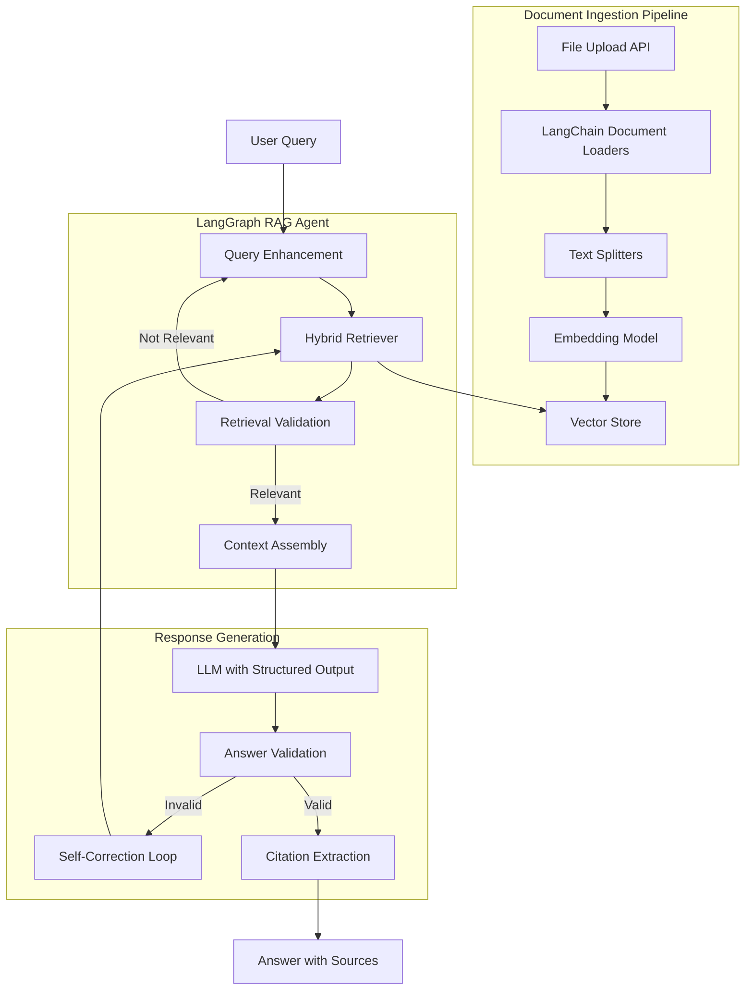
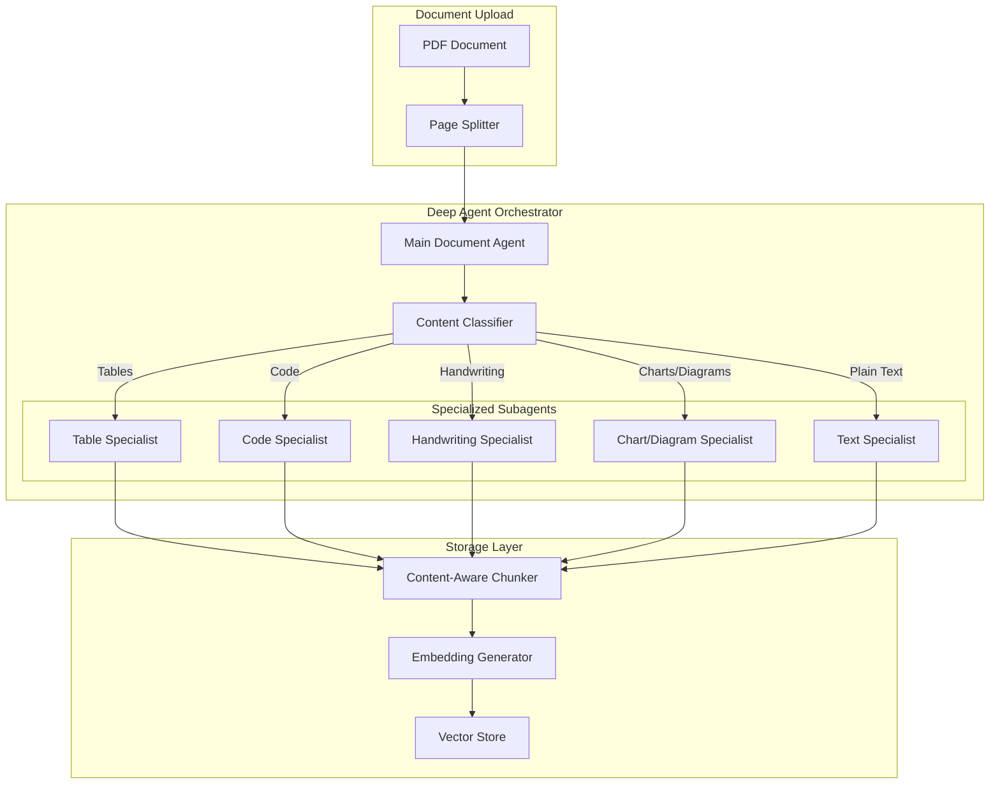
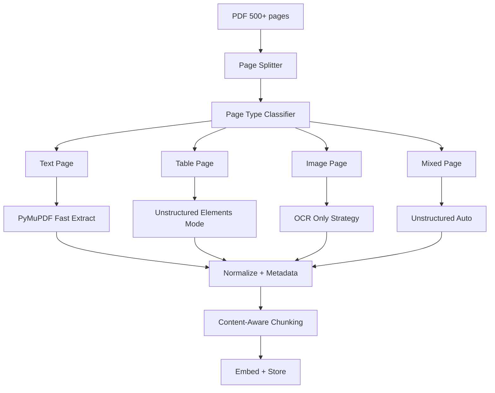

# DocMind RAG

Enterprise Document Intelligence Platform with RAG (Retrieval Augmented Generation)

## Overview

DocMind RAG is a production-ready document intelligence platform built with:

- **LangChain** for document loaders, text splitters, embeddings, and vector stores
- **LangGraph** for durable execution, state management, and complex RAG workflows
- **Deep Agents** for intelligent document processing orchestration with specialized subagents
- **Agentic RAG with Self-Correction** pattern for handling complex queries

## Architecture Overview (Full LangChain Ecosystem)

After reviewing the latest LangChain documentation, we leverage their complete ecosystem:

- **LangChain** for document loaders, text splitters, embeddings, and vector stores
- **LangGraph** for durable execution, state management, and complex RAG workflows
- **Deep Agents** for intelligent document processing orchestration with specialized subagents
- **Agentic RAG with Self-Correction** pattern for handling complex queries



### Deep Agents Architecture (Document Processing Orchestration)

Deep Agents provide intelligent orchestration for complex, multi-step document processing tasks. Instead of processing pages linearly, a main orchestrator agent delegates to specialized subagents based on content type.



#### Why Deep Agents for Document Processing?

| Benefit | Description |
|---------|-------------|
| **Task Decomposition** | Complex 500+ page PDFs are broken into manageable subtasks |
| **Specialized Expertise** | Each subagent is optimized for its content type |
| **Context Isolation** | Subagents maintain focused context, avoiding confusion |
| **Parallel Processing** | Multiple subagents can work simultaneously |
| **Long-term Memory** | Processing state persists across sessions |
| **Adaptive Routing** | Main agent learns which subagent handles what best |

### Page-Level Adaptive PDF Ingestion (Critical for Large Documents)

This is the core innovation for handling large PDFs efficiently. Never process 500 pages at once!



#### Extraction Strategies by Page Type

| Page Type | Extractor | Rationale |
|-----------|-----------|-----------|
| Text only | PyMuPDF | Fast, accurate for pure text |
| Tables | Unstructured (elements) | Preserves table structure |
| Image-only | OCR (Unstructured/Cloud) | Only option for scanned pages |
| Mixed | Unstructured (auto) | Handles complex layouts |

#### Content-Aware Chunking

| Content Type | Chunk Strategy |
|--------------|----------------|
| Text | 600-800 tokens with overlap |
| Tables | Whole table (no splitting) |
| OCR text | 300-500 tokens (noisier) |
| Code | AST-based (by function/class) |

## Features

### Document Processing
- **Adaptive Page Extraction**: Automatically classifies pages as text, tables, images, charts, code, or handwriting
- **Deep Agent Orchestration**: Specialized subagents for different content types
- **Multi-page Table Merging**: Detects and merges tables spanning multiple pages
- **Vision AI Integration**: GPT-4o for charts, diagrams, and handwritten text
- **Code-aware Chunking**: AST-based chunking for programming code
- **Header/Footer Removal**: Automatic detection and removal of repetitive elements
- **Cross-page Text Continuity**: Handles text that continues across page boundaries

### RAG Pipeline
- **Hybrid Retrieval**: Combines dense embeddings with BM25 sparse search
- **Cross-encoder Reranking**: Improves precision with semantic reranking
- **Query Enhancement**: Acronym expansion and query rewriting
- **Self-correction Loop**: Validates retrieval and answer quality

### Production Features
- **Async Processing**: Celery tasks with progress tracking for large documents
- **Streaming Responses**: Server-Sent Events for real-time answer generation
- **Document Management**: CRUD operations for document lifecycle
- **LangSmith Integration**: Built-in observability and debugging

## Architecture

```
docmind-rag/
├── backend/
│   ├── app/
│   │   ├── main.py                 # FastAPI application
│   │   ├── config.py               # Configuration settings
│   │   ├── api/                    # API endpoints
│   │   ├── agents/                 # Deep Agent orchestrator and specialists
│   │   ├── chains/                 # RAG chains (agentic and simple)
│   │   ├── ingestion/              # Document processing pipeline
│   │   ├── retrievers/             # Hybrid retrieval and reranking
│   │   ├── vectorstore/            # Qdrant vector store integration
│   │   └── workers/                # Celery async tasks
│   ├── requirements.txt
│   └── Dockerfile
├── frontend/
│   ├── src/
│   │   ├── App.tsx                 # Main application
│   │   └── components/             # React components
│   ├── package.json
│   └── Dockerfile
└── docker-compose.yml
```

## Quick Start

### Prerequisites
- Docker and Docker Compose
- OpenAI API key

### Running with Docker Compose

1. Clone the repository:
```bash
git clone https://github.com/yourusername/docmind-rag.git
cd docmind-rag
```

2. Set your OpenAI API key:
```bash
export OPENAI_API_KEY=your-api-key-here
```

3. Start all services:
```bash
docker-compose up -d
```

4. Access the application:
- Frontend: http://localhost:3000
- API: http://localhost:8000
- API Docs: http://localhost:8000/docs

### Local Development

#### Backend

```bash
cd backend

# Create virtual environment
python -m venv venv
source venv/bin/activate  # or `venv\Scripts\activate` on Windows

# Install dependencies
pip install -r requirements.txt

# Set environment variables
export OPENAI_API_KEY=your-api-key

# Start Qdrant (requires Docker)
docker run -p 6333:6333 qdrant/qdrant

# Start Redis (requires Docker)
docker run -p 6379:6379 redis:alpine

# Run the API server
uvicorn app.main:app --reload

# In another terminal, start Celery worker
celery -A app.workers.celery_app worker --loglevel=info
```

#### Frontend

```bash
cd frontend

# Install dependencies
npm install

# Start development server
npm run dev
```

## API Endpoints

### Document Upload
```bash
# Async upload with progress tracking
curl -X POST http://localhost:8000/api/upload \
  -F "file=@document.pdf"

# Check progress
curl http://localhost:8000/api/upload/status/{task_id}
```

### Query
```bash
# Agentic RAG query
curl -X POST http://localhost:8000/api/query \
  -H "Content-Type: application/json" \
  -d '{"query": "What is machine learning?", "top_k": 5}'

# Streaming query
curl -X POST http://localhost:8000/api/query/stream \
  -H "Content-Type: application/json" \
  -d '{"query": "Explain the architecture"}'
```

### Documents
```bash
# List all documents
curl http://localhost:8000/api/documents

# Delete a document
curl -X DELETE http://localhost:8000/api/documents/{document_id}
```

## Configuration

Environment variables can be set in `backend/.env`:

```env
# Required
OPENAI_API_KEY=your-api-key

# Vector Store
QDRANT_HOST=localhost
QDRANT_PORT=6333

# Redis
REDIS_URL=redis://localhost:6379/0

# LLM Settings
LLM_MODEL=gpt-4o
VISION_MODEL=gpt-4o

# Processing
CHUNK_SIZE=700
CHUNK_OVERLAP=100
MAX_PARALLEL_WORKERS=8

# LangSmith (optional)
LANGSMITH_API_KEY=your-langsmith-key
LANGCHAIN_TRACING_V2=true
```

## Subagent Responsibilities

Each specialist subagent is optimized for its content type:

```python
# Table Specialist Subagent
table_specialist = create_agent(
    tools=[
        extract_table_structure,
        detect_table_continuation,
        merge_multipage_tables,
        format_table_to_markdown,
    ],
    system_prompt="""You are a Table Extraction Specialist.
    1. Identify table boundaries on the page
    2. Detect if tables continue from previous pages
    3. Merge multi-page tables into complete units
    4. Convert tables to clean markdown format"""
)

# Code Specialist Subagent
code_specialist = create_agent(
    tools=[
        detect_programming_language,
        extract_code_blocks,
        parse_with_ast,
        chunk_by_functions,
    ],
    system_prompt="""You are a Code Extraction Specialist.
    1. Identify code blocks in the document
    2. Detect the programming language
    3. Extract code while preserving formatting
    4. Split code by logical units (functions, classes)"""
)

# Handwriting Specialist Subagent (Vision-capable)
handwriting_specialist = create_agent(
    model="gpt-4o",
    tools=[
        detect_handwritten_regions,
        transcribe_handwriting,
        validate_transcription,
    ],
    system_prompt="""You are a Handwriting Transcription Specialist.
    1. Identify handwritten regions on pages
    2. Accurately transcribe handwritten text
    3. Mark unclear portions with [unclear: ...]"""
)

# Chart/Diagram Specialist Subagent (Vision-capable)
chart_specialist = create_agent(
    model="gpt-4o",
    tools=[
        classify_visual_type,
        describe_chart,
        extract_data_points,
    ],
    system_prompt="""You are a Visual Content Specialist.
    1. Classify visual content (chart, graph, diagram)
    2. Generate detailed text descriptions
    3. Extract key data points and trends"""
)
```

## LangGraph RAG Workflow

The agentic RAG pipeline uses LangGraph for stateful execution with self-correction:

```python
from langgraph.graph import StateGraph, END

class RAGState(TypedDict):
    query: str
    enhanced_query: str
    documents: List[Document]
    answer: str
    is_relevant: bool
    is_valid: bool
    retry_count: int

# Build the graph
workflow = StateGraph(RAGState)
workflow.add_node("enhance", enhance_query)
workflow.add_node("retrieve", retrieve_documents)
workflow.add_node("validate_retrieval", validate_retrieval)
workflow.add_node("generate", generate_answer)
workflow.add_node("validate_answer", validate_answer)

workflow.set_entry_point("enhance")
workflow.add_edge("enhance", "retrieve")
workflow.add_edge("retrieve", "validate_retrieval")
workflow.add_conditional_edges(
    "validate_retrieval",
    lambda x: "generate" if x["is_relevant"] else "enhance"
)
workflow.add_edge("generate", "validate_answer")
workflow.add_conditional_edges(
    "validate_answer",
    lambda x: END if x["is_valid"] else "retrieve"
)

rag_agent = workflow.compile()
```

### Key Features

| Feature | Description |
|---------|-------------|
| **Query Enhancement** | Acronym expansion and semantic rewriting |
| **Hybrid Retrieval** | Dense embeddings + BM25 sparse search with RRF fusion |
| **Cross-encoder Reranking** | Improves precision with semantic relevance scoring |
| **Retrieval Validation** | Ensures retrieved documents are relevant |
| **Answer Validation** | Verifies answers are grounded in source documents |
| **Self-correction Loops** | Automatic retries when validation fails |

## License

MIT License
